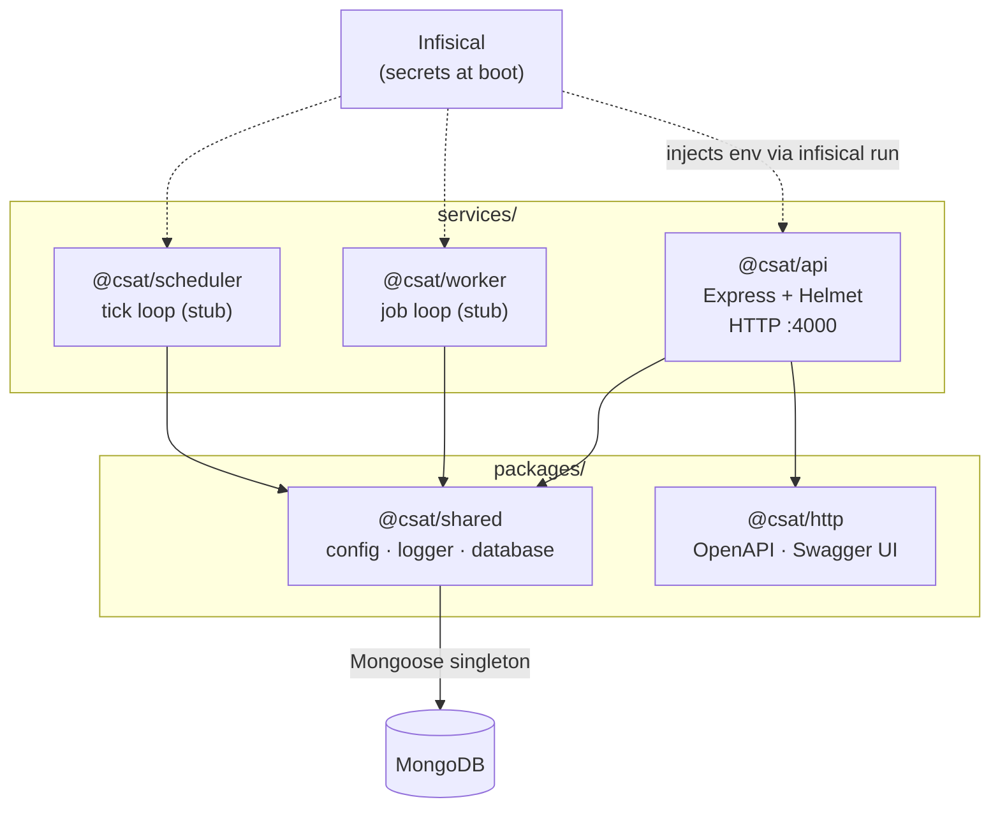
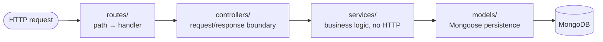

# Architecture overview

`csat-server` is a **service-based TypeScript monorepo** (npm workspaces). Three
long-running services share two internal packages and one MongoDB connection per
process. Everything compiles with TypeScript project references (`tsc --build`).

## Workspaces

```
packages/
  shared/   @csat/shared — config, winston logger, Mongo singleton
  http/     @csat/http   — OpenAPI spec builder + Swagger UI mounting
services/
  api/        @csat/api        — Express + Helmet HTTP service
  worker/     @csat/worker     — background job loop (stub)
  scheduler/  @csat/scheduler  — cron-style tick loop (stub)
```

- **`@csat/shared`** is the foundation every service imports. It exports
  `config` (typed env config), `createLogger`/`logger` (winston), and the
  `database` singleton (one Mongoose connection + pool per process). See its
  [README](../../packages/shared/README.md).
- **`@csat/http`** holds transport-layer helpers reused across HTTP services —
  currently `buildOpenApiSpec` and `mountDocs`. See its
  [README](../../packages/http/README.md).
- The three **services** are independent processes with their own
  `Dockerfile`. Each calls `database.connect()` at boot and registers a graceful
  `SIGTERM`/`SIGINT` shutdown.

## System diagram



## Request flow (api)

A request through `@csat/api` follows a strict layering — each layer only knows
about the one below it:



Details and the reference example (`GET /health`) are in
[API layer](api.md).

## Cross-cutting concerns

- **Secrets** never live in `.env`. They come from a self-hosted Infisical
  project (pinned in `.infisical.json`) and are injected at boot by
  `infisical run`. See [Getting started](../guides/getting-started.md#secrets-infisical).
- **Config** is read once into the typed `config` object in `@csat/shared`;
  services import it rather than reading `process.env` directly.
- **Logging** is structured via winston (`createLogger("<service>")`).
- **Database** is a single shared Mongoose connection — never open a second one;
  import `database` from `@csat/shared`.
- **Deployment** is one container image per service (`services/*/Dockerfile`),
  built and pushed to GHCR by CI, run by the Dokploy orchestrator. See
  [Conventions → CI](../guides/conventions.md#ci-pipeline).
